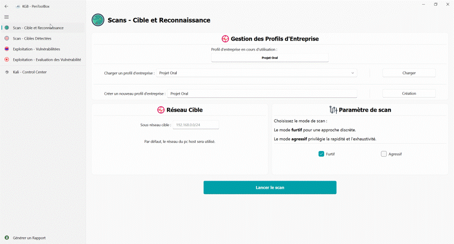
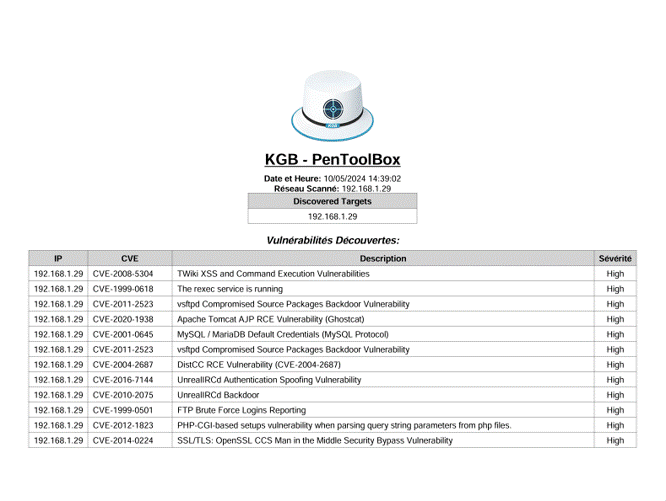

<p align="center">
  
</p>

<h3 align="center">KGB - PenToolBox</h3>
<p align="center">
PenToolBox est un un outil développé dans le cadre du projet de master en ingénierie en cybersécurité.
</p>

## Introduction

Cet outil a été conçu dans le but d'aider les professionnels de la cybersécurité à évaluer la sécurité des systèmes informatiques en identifiant les vulnérabilités.

Exclusivement fonctionnel sur Windows actuellement, il incorpore des fonctionnalités inédites tel que l'intégration complète de Kali.
Permettant ainsi d'utiliser les derniers outils de pentesting disponible sans aucunte limite, tout en permettant en cas de besoin d'avoir la main directement sur celle-ci.


## Table des matières
 
- [Fonctionnalités Clé](#fonctionnalités-clé)
- [Information Importante](#information-importante)
- [Configuration recommandé](#configuration-recommandé)
- [Executable prêt à l'empoloi](#executable-prêt-à-lemploi-)
- [Installation manuelle](#installation-manuelle)
- [Contribution](#contribution)
- [Licence](#licence)
- [Licences des Composants Utilisés](#licences-des-composants-utilisés)

## Fonctionnalités Clé

- 👀 **Reconnaissance**: Exploration des systèmes cibles pour collecter des informations initiales sur les cibles potentielles.
- 🔍 **Scanning**: Analyse des systèmes pour identifier les ports ouverts, les services en cours d'exécution et les vulnérabilités connues.
- 💪 **Exploitation**: Utilisation des vulnérabilités détectées pour accéder aux systèmes cibles et obtenir un accès non autorisé.



- 📄 **Reporting**: Génération de rapports détaillés pour documenter les résultats des tests de pénétration.



- ▶ **Lecture Seul**: Sans VM Kali, l'application est toujours fonctionnel dans un format léger pour charger un profil et vérifier les vulnérabilitées ou les résultats obtenu.

## Information importante

Veuillez noter que l'outil est encore en phase de développement. 
Des bugs critique peuvent encore exister.

> [!IMPORTANT]
> Ce programme pourrait être détecté comme un virus ou un cheval de Troie par certains logiciels antivirus.
> 
> Il s'agit d'un faux positif, ci-dessous le lien vers le scan VirusTotal
> 
> [**Lien scan VirusTotal**](https://www.virustotal.com/gui/file/4461875f43957bc4a4cbe585bcd98bc8539a92f53a415679c5b86e83e73cfcc8)

## Configuration Recommandé

**Recommendation PC :**

**OS** : Windows 10

**CPU** : 6 coeurs

**RAM** : 8 Gb

**Espace Disque** : 15 Go | **En Lecture seul** : 250 Mo

## Executable prêt à l'emploi ✨

Une version compilé pour windows est disponible 🎉🎉

Plus simple et plus rapide à mettre en oeuvre, télécharger la dernière version ci-dessous :

  [***KGB - PenToolBox : Bêta 1.0.3***](https://github.com/KarimGhazlaoui/ASI-M1CB-PenToolBox/releases/tag/1.0.3)


## Installation manuelle

Pour installer les dépendances nécessaires à ce projet, vous pouvez utiliser le fichier `requirements.txt` fourni. 

Exécutez les commandes suivante :

- 1 **Clonez ce dépôt sur votre machine locale.**
  ```console
  git clone https://github.com/KarimGhazlaoui/ASI-M1CB-PenToolBox.git
  cd ASI-M1CB-PenToolBox
  ```

- 2 **Installer Microsoft C++ Build Tools - Développement Desktop en C++ (Obligatoire pour netifaces)**

    [Microsoft C++ Build Tools](https://visualstudio.microsoft.com/visual-cpp-build-tools)<br>


- 3 **Assurez-vous d'avoir les dépendances requises installées.**
  ```console
  pip install -r requirements.txt
  ```
 - 3.1 **Installation manuel des packages**

      Si vous préférez installer les packages individuellement, vous pouvez utiliser les commandes suivantes :
    ```console
    pip install paramiko
    pip install "PyQt-Fluent-Widgets[full]" -i https://pypi.org/simple/
    pip install netifaces
    pip install qvncwidget
    pip install reportlab
    pip install bs4
    ```

- 5 **Télécharger kali.qcow2 et placer le dans le répertoire \app\qemu\kali**
   
     [***Cliquer ici pour télécharger kali.qcow2***](https://drive.google.com/file/d/19TkXSNwm6RxxnFsOpfuVuTnsTJIXfvee/view?usp=sharing)<br>

> [!IMPORTANT]
> Sans l'image ***kali.qcow2***, l'application sera en lecture seul
     
- 6 **Lancez l'application en exécutant le script principal.**
  ```console
  python main.py
  ```


## Contribution
Les contributions sont les bienvenues ! Si vous souhaitez contribuer à ce projet, n'hésitez pas à ouvrir une issue pour discuter des changements que vous souhaitez apporter.

## Licence
Ce projet est sous licence <span style="font-size:1.5em; font-weight:bold;">GPL-3.0</span>.

## Licences des Composants Utilisés

1. **Paramiko** : LGPL 2.1
2. **PyQt** : GPL 3.0
3. **Netifaces** : MIT
4. **QVNCWidget** : GPL 3.0
5. **ReportLab** : BSD
6. **Beautiful Soup (bs4)** : MIT
